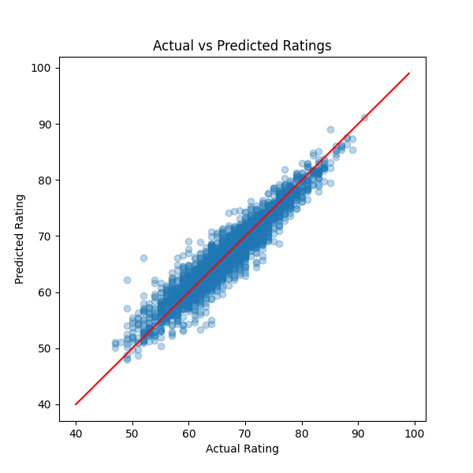
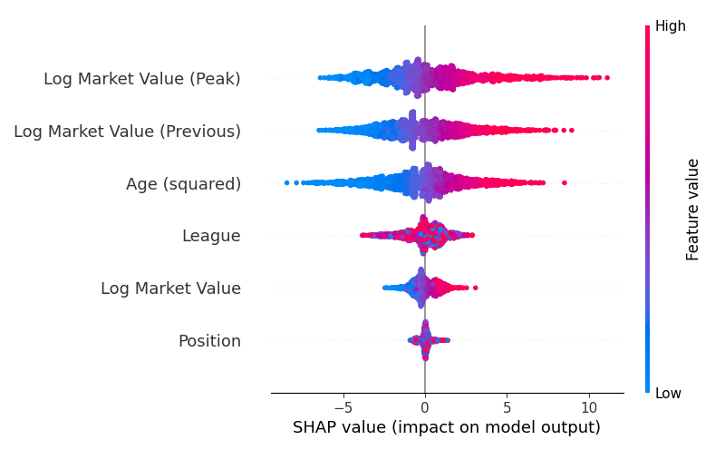

# Transfermarkt Market Values vs EA FC Ratings
*Machine Learning Analysis of Player Valuation and Rating Systems*

## Overview

This project investigates the relationship between football player market values on Transfermarkt and overall ratings in EA Sports FC.

Rather than focusing solely on prediction, the study examines whether economic valuation signals contain meaningful statistical information about in-game player ratings.

Using a dataset of approximately 15,000 matched players, the project applies baseline heuristics, linear regression, and XGBoost models, combined with SHAP explainability, to analyze how different factors contribute to EA FC overall ratings.

## Research Question

This study investigates whether a statistical relationship exists between Transfermarkt market values and EA Sports FC overall ratings, and to what extent market-based signals can explain rating variation.

## Highlights

- Built a custom dataset by matching ~15,000 players across EA FC 26 and Transfermarkt  
- Developed a multi-stage deterministic player matching pipeline without a shared identifier  
- Achieved **R² = 0.90** using only market-based and contextual variables  
- Applied SHAP explainability to uncover economic, age, league, and positional effects  
- Analyzed how age, league, and position influence rating formation  

## Dataset

### EA Sports FC 26 Database
- ~18,000 male players  
- overall rating
- team
- league
- nationality
- position
- jersey number
- date of birth

### Transfermarkt Dataset
- market value  
- previous market value  
- peak market value  
- team
- league
- nationality
- position
- jersey number
- date of birth

Only the **33 leagues present in EA Sports FC 26** were extracted from Transfermarkt to ensure dataset consistency.

Players were matched using:
- Date of birth  
- Nationality  
- Team  
- Jersey number  

Final dataset size: **~15,000 matched players**

## Player Matching Pipeline

A deterministic multi-stage matching pipeline was implemented because the two datasets do not share a common player identifier.

- Stage 1: Exact match (all attributes)  
- Stage 2: Relaxed matching (3-feature combinations)  
- Stage 3: Partial fallback matching (2 features)  

## Methodology

### 1. Baseline Model

Age-adjusted market value heuristic

### 2. Linear Regression

**Features:**
- log(current market value)
- log(previous market value)
- log(peak market value)
- Age²
- League (categorical)
- Position (categorical)

### 3. XGBoost Regression

Non-linear model capturing interactions between market signals, age dynamics, league effects, and positional structure.

**Features (identical to Linear Regression):**
- log(current market value)
- log(previous market value)
- log(peak market value)
- Age²
- League (categorical)
- Position (categorical)

Model interpretability was performed using SHAP.

## Results

| Model | R² | RMSE |
|------|------|------|
| Baseline | 0.82 | 2.29 |
| Linear Regression | 0.872 | 2.46 |
| XGBoost | 0.900 | 2.17 |

This indicates that market-based and contextual features explain a large portion of EA FC rating variance, suggesting strong statistical alignment between economic valuation and in-game player assessment systems.

## Key Insights

- Market value strongly correlates with EA FC ratings  
- Age introduces structural divergence:
  - young players → investment-driven valuation  
  - older players → experience-based rating effect  
- League context systematically shifts predictions  
- Position creates structural pricing inefficiencies:
  - goalkeepers/defenders undervalued  
  - midfielders relatively overpriced  

## Model Explainability (SHAP)

The SHAP analysis reveals how each feature contributes to the final EA FC rating prediction. The most influential features are:

Age: one of the most influential features in rating prediction
Peak Market Value: strong indicator of historical player quality
Previous Market Value: captures recent valuation dynamics
Current Market Value: contributes modest but consistent signal

## Repository Structure

- data/ — sample dataset output  
- figures/ — plots used in the report  
- report/ — full research paper (PDF)  
- README.md — project documentation  

## Conclusion

Transfermarkt market values contain strong statistical signals related to EA FC overall ratings.

Using XGBoost and SHAP explainability, the study shows that market value, age, league, and position collectively explain approximately 90% of the variance in player ratings.

## Sample Model Output

A sample of the final prediction dataset is available below.

[Download Sample Predictions](data/ea_fc_rating_predictions_sample.xlsx)

## Full Paper

Read the full research report:

[Read Full Paper (PDF)](report/ea_fc_transfermarkt_analysis.pdf)
